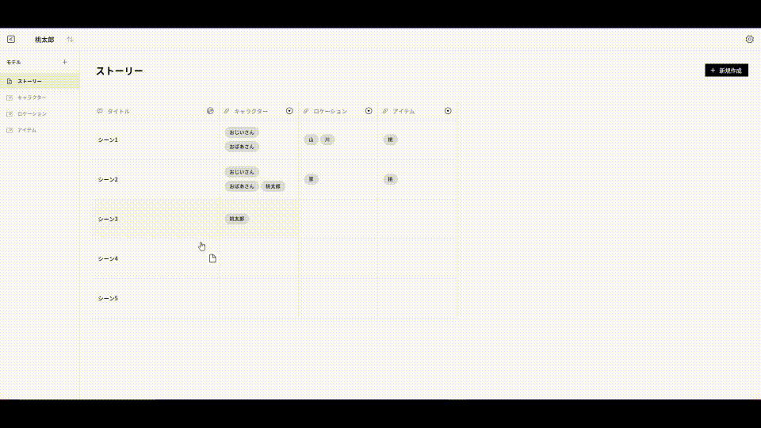

# Hoya👋

Feel free to [DM me](https://x.com/natsuk4ze). Formerly a game developer and now a Flutter engineer.
Currently working for [snkrdunk](https://apps.apple.com/jp/app/%E3%82%B9%E3%83%8B%E3%83%BC%E3%82%AB%E3%83%BC%E3%83%80%E3%83%B3%E3%82%AF-%E3%82%B9%E3%83%8B%E3%83%BC%E3%82%AB%E3%83%BC-%E3%83%88%E3%83%AC%E3%82%AB%E3%81%AE%E3%83%95%E3%83%AA%E3%83%9E%E3%82%A2%E3%83%97%E3%83%AA/id1455592069) as freelance.

## 💙 Flutter Projects

| Project | Preview |
| ------- | ------- |
| [nomap 🗺️ - navigation app without map](https://nomap-app.studio.site)  <a href="https://github.com/natsuk4ze/gal"></a> |   |
| [Gal 🖼 - Flutter plugin for handle native gallery apps](https://pub.dev/packages/gal)   |   |
| [npm client 📦 - npm client app with modern flutter coding style](https://github.com/natsuk4ze/npm)   |   |
| [CompassX 🧭 - Compass Plugin for flutter](https://pub.dev/packages/compassx)   |  |
| [Planet 📚 - CMS for story writer made with flutter web.](https://planet-1424d.web.app)  🔗 <a href="https://planet-1424d.web.app">Website</a>|  |

## 🧙 Flutter UI Challenges
| [🌈 Holo effects](https://github.com/natsuk4ze/holo) | [🤩 RGB effects](https://github.com/natsuk4ze/rgb_lights) |
| :-------: | :-------: |
|     <a href="https://github.com/natsuk4ze/holo"> |    <a href="https://github.com/natsuk4ze/rgb_lights">|

## 🎮 Game Projects

| Project | Preview |
| ------- | ------- |
| [Link 🏢](https://github.com/natsuk4ze/link)  3D simulation game created by the team at HAL Tokyo🏫 using DirectX. *HAL Grand Prize*🏅 |  |
| [City Star Liner 🌌](https://github.com/natsuk4ze/city-star-liner)  3D shooting game created by the team RedCopper👒 at HAL Tokyo🏫 using DirectX. |  |
| [Tank Beats 🎵](https://github.com/natsuk4ze/tank-beats)  3D music x shooting game ceated by Midori using DirectX. |  |
| [Space Rabbits 🐰](https://github.com/natsuk4ze/space-rabbits)  2D shooting game ceated by Midori using DirectX. |  |

## Awards 🎖

* *HAL Grand Prize*🏅 at 未来創造展
-> 🎁 Bali trip for a week.

## About Me

* Birth - 2000
* Location - Tokyo
* Fav - Art🎨, Music🎵, ASMR🎙, Earing✨
